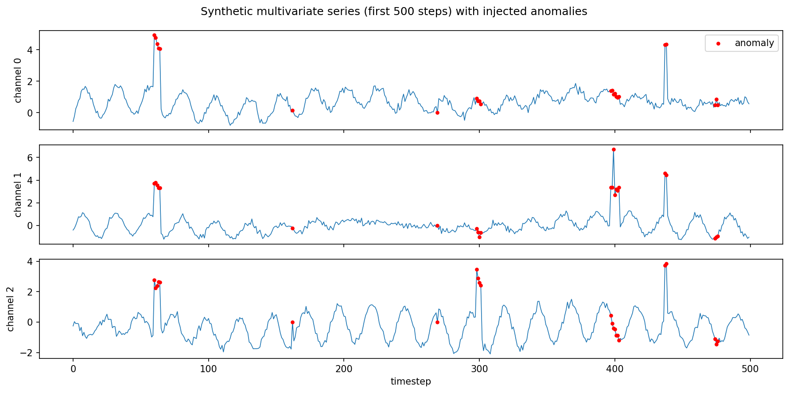
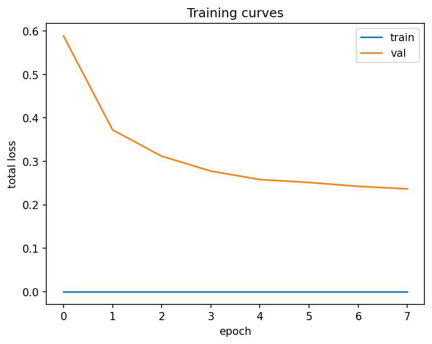
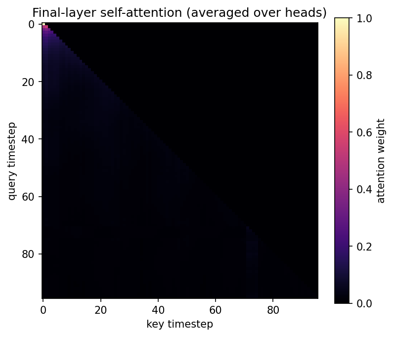

# TimeSeries Forge

**Multi-task probabilistic forecasting and anomaly detection for multivariate time series, built from scratch on PyTorch.**

A single shared encoder jointly learns to (1) forecast multiple future
steps with calibrated uncertainty bands and (2) detect anomalies via
reconstruction error — useful for any domain with multivariate sensor,
infrastructure, or financial telemetry: server/cluster metrics, IoT
sensor networks, energy load, demand forecasting, or financial
indicators.

This is a from-scratch PyTorch implementation (no `transformers`
library, no off-the-shelf forecasting model import) covering the full
lifecycle: custom architecture → training pipeline → rigorous
evaluation → deployment.

```
            ┌─────────────────────────────────────────────┐
 raw input  │  Variable Selection Network                  │
 (B,T,F) ──▶│  (learns per-timestep feature importance)    │
            └───────────────────┬───────────────────────────┘
                                 ▼
            ┌─────────────────────────────────────────────┐
            │  Learned Positional Encoding                  │
            │  + N × [Interpretable Multi-Head Attention     │
            │         + Gated Residual Network feedforward]  │
            └───────────────────┬───────────────────────────┘
                                 ▼
                    shared encoded representation
                         (B, T, d_model)
                      ╱                        ╲
                     ▼                          ▼
        ┌───────────────────────┐   ┌─────────────────────────┐
        │ Attention pooling      │   │ Reconstruction decoder    │
        │ → Quantile Forecast    │   │ → per-timestep             │
        │   Head (non-crossing   │   │   anomaly score             │
        │   quantiles)           │   │                              │
        └───────────────────────┘   └─────────────────────────┘
          forecast: (B,H,targets,Q)      reconstruction: (B,T,F)
```

## Why this design

## Demo output

Synthetic multivariate sensor data with injected, labeled anomalies (red dots):





Training curves (train vs. validation loss) over a short demo run:





Final-layer self-attention, averaged over heads — one of the interpretability
artifacts available from every forward pass:




| Component | What it is | Why it's here |
|---|---|---|
| **Variable Selection Network** | Per-timestep, learned softmax weighting over input channels | Gives a built-in, inspectable "which sensor mattered" signal instead of a black box |
| **Gated Residual Network (GRN)** | Residual block with an internal GLU gate | Lets the network *skip* irrelevant computation rather than being forced through every layer |
| **Interpretable Multi-Head Attention** | Multi-head attention with a single **shared** value projection across heads | Keeps multi-head expressiveness for *what to attend to*, while making the averaged attention map a single coherent interpretability artifact instead of H disjoint ones |
| **Quantile forecast head** | Predicts multiple quantiles (e.g. p10/p50/p90), not a point estimate, with a monotonicity constraint to prevent quantile crossing | Real decisions (alerting thresholds, capacity planning) need uncertainty, not just a point guess |
| **Reconstruction anomaly head** | Shares the encoder; reconstructs the input window, anomaly score = reconstruction error | Multi-task sharing acts as regularization: a representation good for forecasting the future is pushed to also explain the recent past |
| **Learned uncertainty-weighted multi-task loss** | `log_var` parameters per task (Kendall et al., 2018) instead of a hand-tuned λ | The optimizer — not a guessed constant — balances forecasting loss against reconstruction loss as training progresses |

## Repository structure

```
timeseries-forge/
├── src/timeseries_forge/
│   ├── models/
│   │   ├── layers.py        # GLU, GRN, Variable Selection Network, attention
│   │   ├── heads.py         # positional encoding, quantile + reconstruction heads
│   │   └── forge_net.py     # ForgeNet: full model, forward, multi-task loss
│   ├── data/
│   │   ├── datasets.py      # ChannelScaler, SlidingWindowDataset, chronological split
│   │   └── synthetic.py     # synthetic multivariate series + labeled anomalies
│   ├── training/
│   │   ├── trainer.py       # AMP, grad accumulation/clipping, scheduling, logging
│   │   ├── scheduler.py     # cosine LR schedule with linear warmup
│   │   └── checkpoint.py    # EarlyStopping + CheckpointManager
│   ├── evaluation/
│   │   ├── forecast_metrics.py   # pinball loss, MAE/RMSE/MAPE, quantile coverage
│   │   ├── anomaly_metrics.py    # precision/recall/F1, point-adjusted F1, ROC-AUC
│   │   └── walk_forward.py       # rolling-origin time series cross-validation
│   ├── deployment/
│   │   ├── export.py        # TorchScript (trace) + ONNX export with dynamic axes
│   │   └── server.py        # FastAPI inference server
│   └── utils/seed.py
├── scripts/
│   ├── train.py             # end-to-end training entrypoint
│   ├── evaluate.py          # checkpoint evaluation entrypoint
│   ├── export_model.py      # export a checkpoint to TorchScript/ONNX
│   └── load_test.py         # concurrent smoke/load test for the deployed API
├── notebooks/demo.ipynb      # full interactive walkthrough with plots
├── tests/                     # pytest suite (layers, model, data, eval, export)
├── docker/                     # Dockerfile + docker-compose for serving
└── .github/workflows/ci.yml    # lint + test on every push/PR
```

## Quickstart

```bash
git clone https://github.com/Arman-046/timeseries-forge.git
cd timeseries-forge
pip install -e ".[dev,viz]"
pytest                       # run the test suite (no GPU required)
```

### Train on synthetic data (no dataset required to try this out)

```bash
python scripts/train.py --epochs 30 --d-model 128 --n-layers 3
```

### Train on your own data

```bash
python scripts/train.py --data-path your_series.csv --target-indices 0 1 --seq-len 168 --horizon 24
```
`your_series.csv` should have one column per channel/sensor and rows in chronological order.

### Train on real data (Beijing PM2.5 air quality, hourly, 2010–2014)

The repo ships with a synthetic-data generator so it runs with zero
setup, but it's also wired up to a real public dataset out of the box:
hourly PM2.5 pollution + meteorological readings from the US Embassy
in Beijing (UCI ML Repository, dataset id 381) — a genuine multivariate
sensor-telemetry forecasting problem.

```bash
pip install -e ".[real-data]"
python scripts/prepare_real_data.py --output-path data/beijing_pm25.npy
python scripts/train.py --data-path data/beijing_pm25.npy --target-indices 0 2 --seq-len 168 --horizon 24
```
(`--target-indices 0 2` forecasts `pm2.5` and `TEMP`; see
`data/beijing_pm25.channels.txt`, written alongside the `.npy` file,
for the full channel order.) The loader handles the dataset's missing
values via interpolation by default (`--fill-method`).

### Evaluate

```bash
python scripts/evaluate.py --checkpoint checkpoints/best.pt
```
Produces a JSON report with both forecast calibration metrics and anomaly-detection metrics.

### Export and serve

```bash
python scripts/export_model.py --checkpoint checkpoints/best.pt
pip install -e ".[serve]"
uvicorn timeseries_forge.deployment.server:app --reload
# in another terminal:
python scripts/load_test.py --n-requests 200 --concurrency 20
```

Or with Docker:
```bash
docker compose -f docker/docker-compose.yml up --build
```

## Evaluation methodology (and why it's not the naive approach)

- **Chronological splits only.** `train_val_test_split_indices` never
  shuffles; shuffling before splitting a time series lets the model
  train on future data to "predict" the past, producing a validation
  score that is meaningless in production.
- **Walk-forward cross-validation** (`evaluation/walk_forward.py`)
  rolls the training window forward across several folds, always
  validating strictly after the training block, rather than k-fold
  CV's random shuffling.
- **Calibration, not just point accuracy.** `evaluate_forecast` reports
  empirical quantile coverage and mean interval width alongside
  MAE/RMSE — a model can have an excellent MAE and still be badly
  over- or under-confident in its uncertainty bands.
- **Point-adjusted F1 reported alongside raw F1** for anomaly
  detection (Xu et al., 2018 protocol): a single flag anywhere inside
  a true anomalous segment counts as a detection, matching how an
  on-call operator actually uses these alerts, while still reporting
  raw point-wise F1 so the gap between the two is visible rather than
  hidden behind a flattering number.
- **ROC-AUC computed via the exact rank-sum identity** (no sklearn
  dependency, no threshold-grid approximation error).

## Training engineering

- Automatic mixed precision (`torch.amp.autocast` + `GradScaler`)
- Gradient accumulation for effective batch sizes larger than what
  fits in memory
- Gradient norm clipping (attention-heavy architectures are prone to
  destabilizing early-training spikes)
- Cosine learning-rate schedule with linear warmup, implemented from
  scratch against `LambdaLR`
- Early stopping + best/last checkpointing with full optimizer/
  scheduler state for exact resume
- TensorBoard scalar logging (train/val loss, per-task loss, learned
  task weights)

## Deployment notes

- `deployment/export.py` wraps the model in a fixed tensor-in/tensor-out
  module before tracing, since `ForgeNet.forward` returns a dict and
  takes an optional argument — neither exports cleanly to TorchScript/
  ONNX directly.
- ONNX export uses `dynamic_axes` for batch size and sequence length,
  since a real deployment sees both single-sample online inference and
  larger batched backfill jobs.
- The FastAPI server (`deployment/server.py`) loads the scaler
  alongside the model so clients send **raw, unscaled** values and
  never need to know about normalization internals.
- `docker/Dockerfile` is a multi-stage build so training-only
  dependencies (tensorboard, matplotlib, pytest) never ship in the
  production image.

## Extending this project

- **Scale to true production size**: swap `DataLoader` for
  `DistributedSampler` + `DistributedDataParallel` for multi-GPU
  training; the `Trainer` class's device-agnostic design (autocast
  device_type, GradScaler enabled flag) makes this a small diff.
- **Add covariates**: the `static_dim` config option in `ForgeNetConfig`
  is already wired through the Variable Selection Network and GRNs for
  static (non-time-varying) context such as sensor metadata or site ID
  — currently unused by the training scripts but ready to plug in.
- **Swap the anomaly protocol**: `evaluation/anomaly_metrics.py` is
  decoupled from the model, so you can score any anomaly detector's
  output array against the same labeled synthetic benchmark.

## References

- Lim, B. et al. (2021). *Temporal Fusion Transformers for
  Interpretable Multi-horizon Time Series Forecasting.* — architectural
  inspiration for the GRN/VSN/interpretable-attention design.
- Kendall, A., Gal, Y., & Cipolla, R. (2018). *Multi-Task Learning
  Using Uncertainty to Weigh Losses for Scene Geometry and Semantics.*
  — the learned homoscedastic uncertainty weighting used to combine
  the forecasting and reconstruction losses.
- Xu, H. et al. (2018). *Unsupervised Anomaly Detection via Variational
  Auto-Encoder for Seasonal KPIs in Web Applications.* — source of the
  point-adjusted F1 evaluation protocol.
- Liang, X. et al. (2015). *Assessing Beijing's PM2.5 pollution:
  severity, weather impact, APEC and winter heating.* Proceedings of
  the Royal Society A. — source of the optional real-data benchmark
  (`scripts/prepare_real_data.py`), via UCI ML Repository dataset id 381.

## License

MIT — see [LICENSE](LICENSE).
